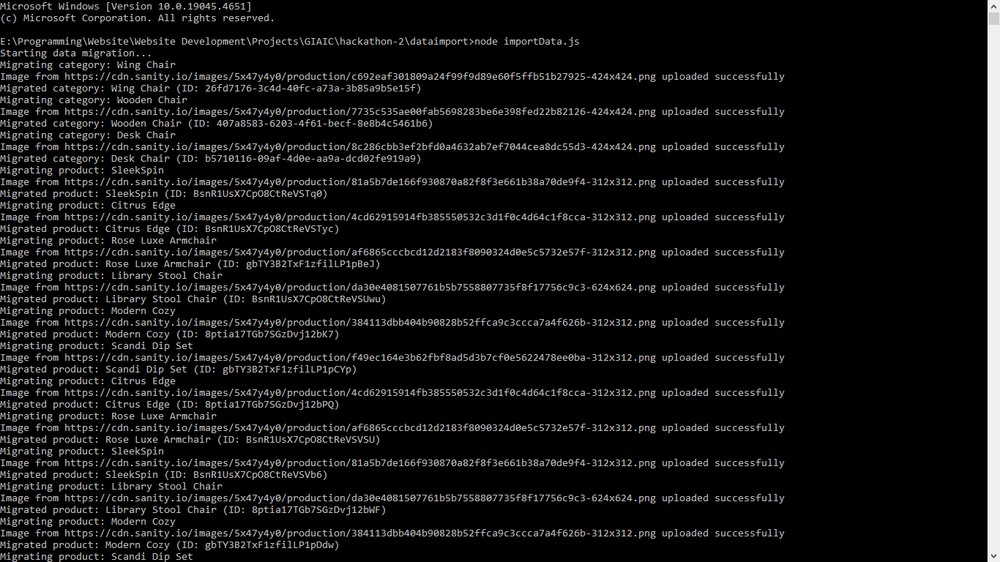
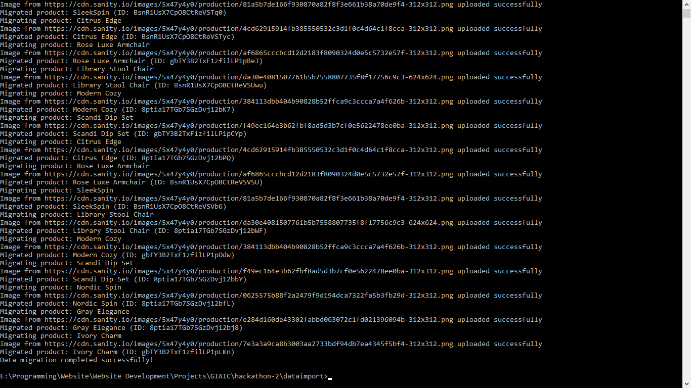
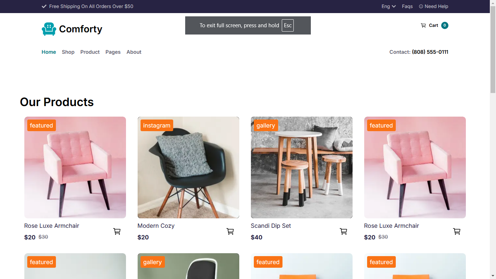
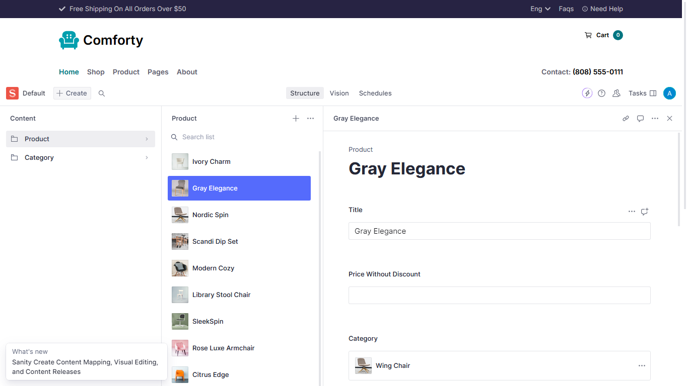

# API Integration and Migration Report

## API Integration Process

### Step 1: Understanding the API Structure

- **Products Endpoint**: `https://giaic-hackathon-template-08.vercel.app/api/products`
  - Provides product details, including title, price, category, tags, and image URL.
- **Categories Endpoint**: `https://giaic-hackathon-template-08.vercel.app/api/categories`
  - Provides category details, including title and associated image URL.

### Step 2: Environment Setup

- Created a `.env.local` file to securely store API keys and URLs:
  ```env
  NEXT_PUBLIC_SANITY_PROJECT_ID=3nblidkr
  NEXT_PUBLIC_SANITY_DATASET=production
  NEXT_PUBLIC_SANITY_AUTH_TOKEN="******"
  BASE_URL=https://giaic-hackathon-template-08.vercel.app
  ```

### Step 3: Integration with Sanity CMS

- Utilized the `@sanity/client` library to interact with the Sanity backend.
- Configured the client:
  ```javascript
  const targetClient = createClient({
    projectId: process.env.NEXT_PUBLIC_SANITY_PROJECT_ID,
    dataset: process.env.NEXT_PUBLIC_SANITY_DATASET || "production",
    useCdn: false,
    apiVersion: "2025-01-17",
    token: process.env.NEXT_PUBLIC_SANITY_AUTH_TOKEN,
  });
  ```

## Adjustments Made to Schemas

1. **Category Schema**

   - Adjusted `_type` from `categories` to `category` for consistency.

2. **Product Schema**
   - Adjusted `_type` from `products` to `product`.

## Migration Steps and Tools Used

### Tools

- **Sanity Client**: For interaction with the Sanity backend.
- **Node.js Fetch API**: For API requests.

### Migration Steps

1. **Fetch Data from APIs**

   - Used `fetch` to retrieve data from the `products` and `categories` endpoints.

2. **Upload Images to Sanity**

   - Implemented an `uploadImageToSanity` function to handle image uploads and return asset IDs.

3. **Migrate Categories**

   - Processed categories and mapped their original IDs to new Sanity IDs for reference mapping.

4. **Migrate Products**
   - Processed products, linked them to the migrated categories, and uploaded their associated images.

## Screenshots

### API Calls

- **Categories API Response**:
  
- **Products API Response**:
  

### Data Displayed in Frontend



### Populated Sanity CMS Fields


